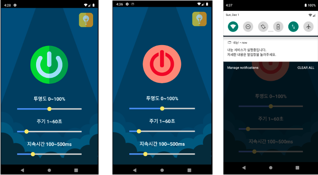
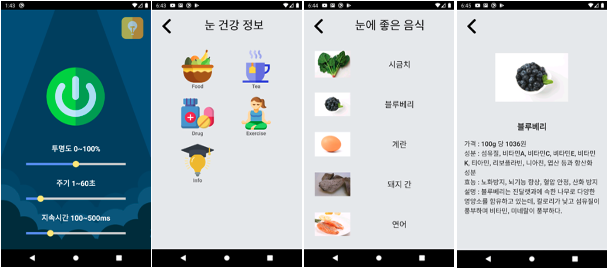
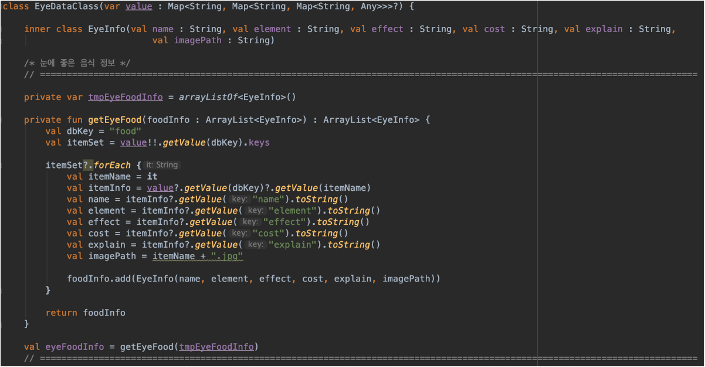
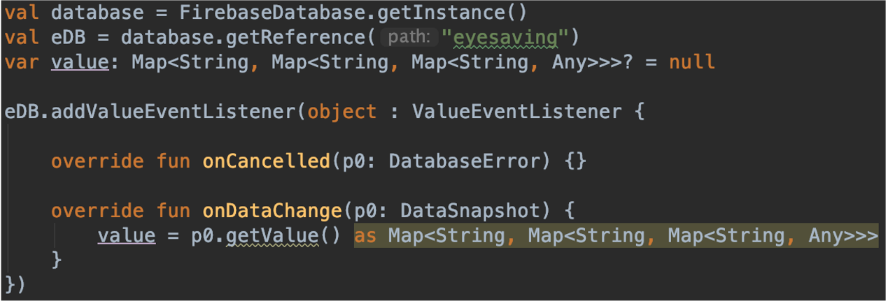
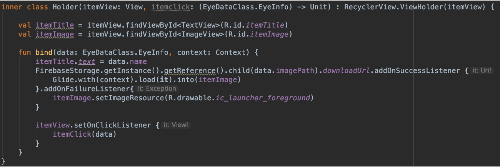

# EmbeddedSoftware_Project


* [Download available on Google Play Store](https://play.google.com/store/apps/details?id=com.SmuEMSW.smumyeyes)

> 2019년 10월 31일 ~ 2020년 1월 10일<br>
> 2019년 2학기 임베디드 소프트웨어(코틀린 안드로이드) 수업 기말 과제 및 구글 플레이 스토어 출시 앱 프로젝트

## 🖇️ Contents
- [EmbeddedSoftware_Project](#embeddedsoftware_project)
  - [🖇️ Contents](#️-contents)
  - [💻 Stack](#-stack)
    - [Prerequisites](#prerequisites)
    - [Built With](#built-with)
  - [💡 Features](#-features)
    - [1. Background overlay](#1-background-overlay)
    - [2. Get data from Google Firebase](#2-get-data-from-google-firebase)
    - [3. Get settings information](#3-get-settings-information)
  - [Authors](#authors)

<h3 align='center'>Preview</h3>
<p align='center'>
  <br>
  
</p>

## 💻 Stack
<p>
  
  
  
  
</p>

### Prerequisites

```
At least : Android 5.0(Lollipop) above

Recommand : Android 8.0(Oreo) above
```

### Built With

* [Android Studio](https://developer.android.com/studio)
* [Kotlin](https://kotlinlang.org/)


## 💡 Features

### 1. Background overlay
  * 눈 깜빡임 유도를 위해 실행 시 지정된 주기에 맞게 화면 깜빡임 실행
    * 백그라운드에서 실행되어야 하기 때문에 해당 권한 요청 코드 삽입
    ```kotlin
    if (!Settings.canDrawOverlays(this)) {
      startActivity(
        Intent(
          "android.settings.action.MANAGE_OVERLAY_PERMISSON",
          Uri.parse("package:" + getPackageName())
        )
      )
      return false
    }
    return true
    ```
  * Notification을 통해 서비스가 실행되고 있음을 사용자에게 안내
  * 앱을 다시 실행한 후 서비스 종료 클릭 시 해당 기능 종료

### 2. Get data from Google Firebase
  * 출시 앱에는 미포함된 기능
  * `FirebaseRealtimeDatabase` & `FirebaseStorage` 사용
  * 눈 건강과 관련된 정보들을 데이터 베이스에서 불러와서 사용자에게 제공
  * 데이터 클래스 설계
     
  * `Firebase` instance 조회
    
  * 데이터 바인딩
    

### 3. Get settings information
  * `.ini` 파일에 유저가 설정한 값을 저장
  * 앱 실행 시 해당 값을 읽어 유저가 이전에 사용한 값으로 설정

## Authors

* PM : [KyeongMoon](https://github.com/KyeongMoon)

* Dev
  * [201411108](https://github.com/201411108)
  * [ImSangKyun](https://github.com/ImSangKyun)
  * [skyghdus](https://github.com/skyghdus)

See also the list of [contributors](https://github.com/201411108/EmbeddedSoftware_Project/graphs/contributors) who participated in this project.